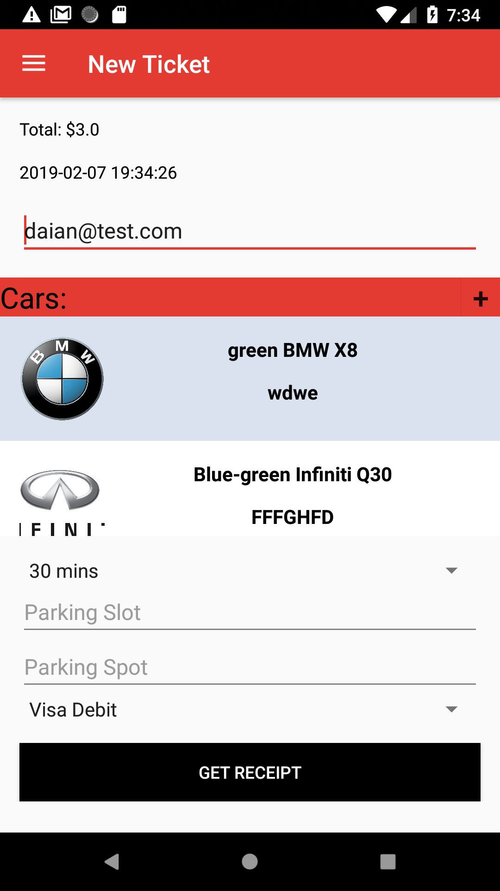
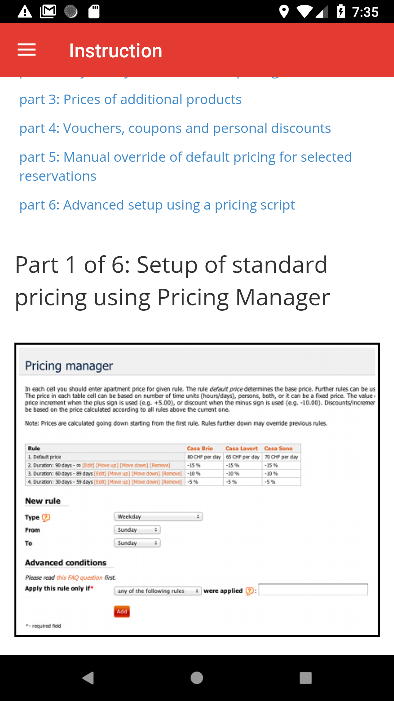

## ParkYourCar - Demo application for Android

Originally this application was part of the final project for college's Android course, however I decided to expand it functionality in order to learn new technology and to implement them into current app. I've added Firebase authentication, Firebase database for storing user data and Firebase storage to store images.

Basically, user can create new account, add new car to personal car list and create new parking ticket.

I used <b>MVC</b> concept during creation of this project as well as SOLID concept.

### Gradle dependecies

- [Firebase](https://firebase.google.com) - authentication, storing data
- [Picasso](https://github.com/square/picasso) - a powerful image downloading and caching library

### Summary

During creation of this app I've learned a plenty of new technology and dived into development process. I learned how to use Gradle manager, how to implement Firebase functionality in Android application, how to manage project using Trello as task manager I divide project on little parts and did them with scrum methodology. In this application I more dived in MVC and SOLID concepts for creating application.

### Demos

- SignUp screen

- Login screen

- Home - user info + user can add new car into the list as well as delete one from there

- Menu

- Update profile - taping "edit profile" button on home screen

- Add new ticket - during creating new ticket user can choose car from personal lsit or add new car to list

- Add new car - screen for creating new car for user list

- Report screen - list of all created tickets by user. They can be filetered by plate number

- Ticket - summary information of the ticket

- Contact - taping help button on home screen

- Instruction - I've just got this instruction from third party parking website. I use JavaScript code to crop webpage for proper format.

- Location - current user location

